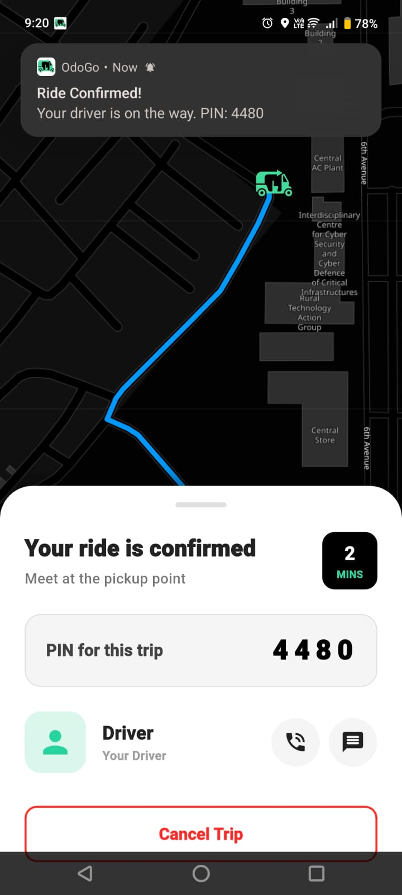
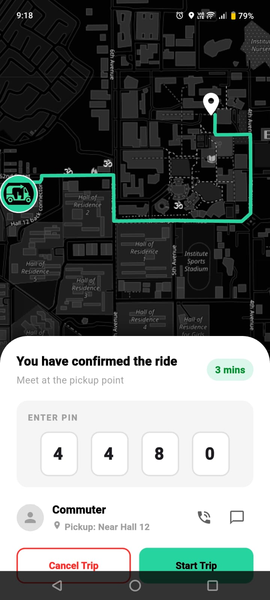
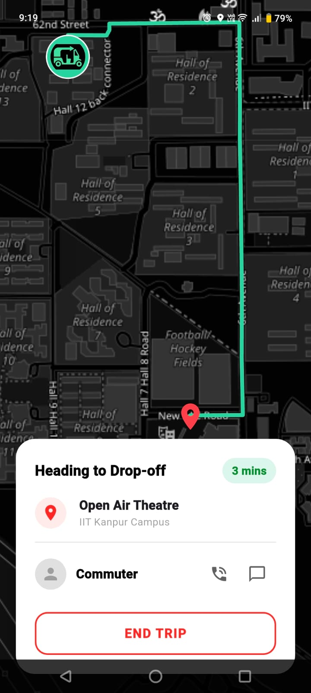
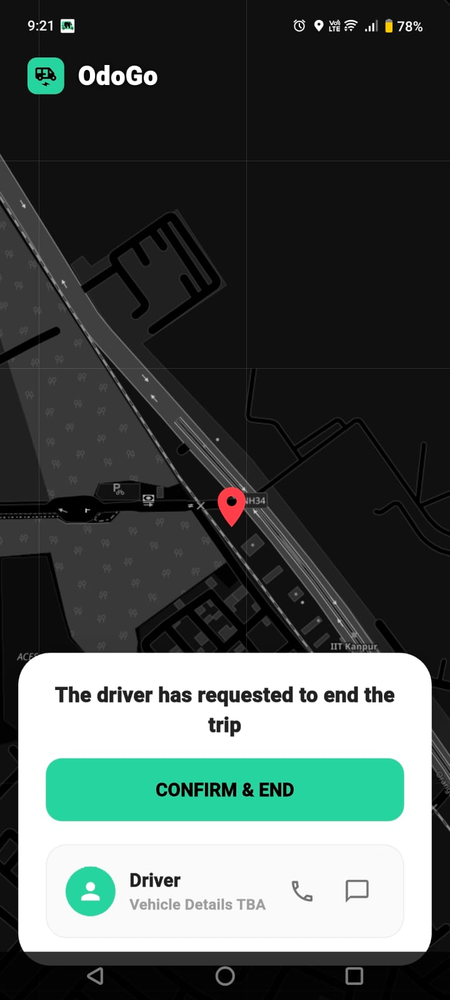

OdoGo: Campus Ride-Sharing Application
==================================


This full-stack web application is made as a course project of [CS253](https://www.cse.iitk.ac.in/users/isaha/Courses/sdo25.shtml/): Software Development and Operations in Spring 2024 under the guidance of [Prof. Indranil Saha](https://www.cse.iitk.ac.in/users/isaha/). This full-stack Flutter application was built to solve intra-campus mobility issues (specifically targeting the IITK campus environment). OdoGo is an integrated ride-sharing platform connecting two distinct user categories within a single application: **Commuters** and **Drivers**.

The platform simplifies booking immediate rides, scheduling future trips, and tracking real-time locations using custom map integrations.

## Core Features

### For Commuters:
* **Dual-Booking Modes:** Request immediate rides or schedule rides in advance (with strict >20 min validations).
* **Smart Campus Routing:** Auto-completion and predefined drop-off/pickup markers for campus locations (e.g., Hall 12, Academic Area).
* **Real-Time Tracking & Alerts:** Live map tracking via `flutter_map` and native push notifications when a driver accepts, arrives, or completes a trip.
* **Secure OTP Rides:** Secure ride handoffs using a dynamically generated Ride PIN.

### For Drivers:
* **Online/Offline Toggles:** Smart state management that only broadcasts rides to active, online drivers to save Firebase reads and battery.
* **Time-Windowed Broadcasting:** Scheduled rides are automatically broadcasted to available drivers at specific intervals (2 hours, 1 hour, and continuously at the 20-minute mark).
* **Queue Management:** Clean UI to accept incoming requests, view upcoming scheduled bookings, and auto-hide rides that have already been claimed by others.

---

## Tech Stack & Architecture

This project is built with developer sanity in mind, utilizing modern Flutter standards:
* **Framework:** Flutter
* **Backend:** Firebase
* **State Management:** `flutter_riverpod`
* **Maps & Location:** `flutter_map`, `latlong2`, and `geolocator`.
* **Native Integrations:** `flutter_local_notifications` (with Core Library Desugaring for Android).

---

## How to run the software locally?

**Prerequisites:**
* Flutter SDK installed.
* An active Firebase project linked via FlutterFire CLI (ensure `firebase_options.dart` is present).
* *Android Developers:* Ensure your emulator/device runs API 26 or higher (Android 8.0+) due to native notification desugaring requirements.

**1. Clone the repository:**
```bash
git clone https://github.com/Chwiz67/odogo_app.git
cd odogo_app
```

**2. Install dependencies:**
```bash
flutter pub get
```

**3. Run the App:**
To make testing easier and avoid burning through API limits, use the following flag to bypass real OTP verification. 
*(When using this flag, enter **`0000`** on the OTP screen to authenticate).*

```bash
flutter run --dart-define=BYPASS_OTP=true
```

---

## Codebase Directory and Navigation Guide

If you are picking up this codebase, here is what's happening:

```text
lib/
├── controllers/       # Firebase read/write logic and background stream processing
├── core/              # GoRouter definitions and auth-redirect logic
├── data/              # Static constants and campus location LatLngs
├── models/            # Class Structure and Fields of Objects used in the code
├── repositories/      # Direct Firestore abstraction layer
├── services/          # Notifications and Auth services
└── views/             # UI Layer
``` 

---

## App Gallery & Interfaces

**1. Commuter Home**
> Features the `flutter_map` integration with custom drop-off/pickup markers.


**2. Driver Home**
> Features an intelligent `StreamProvider` that automatically hides rides if they are claimed by another driver.


**3. Scheduled Booking Engine**
> Allows commuters to book rides >20 minutes in advance.


**4. Ride Flow**
> Displays the active trip status. Commuters receive native push notifications featuring a dynamically generated 4-digit Ride PIN for secure handoffs.

**User Ride Confirmed** 



**Driver Ride PIN** 



**Driver Ride Ongoing** 



**End Trip Confirmation** 



---

## Documentation

* **Software Requirement Specification (SRS):** TBA <!--[Link to SRS Document](#)-->
* **Software Design Document (SDD):** TBA <!--[Link to SDD Document](#)-->
* **Software Implementation Document (SID):** TBA <!--[Link to SID Document](#)-->
* **Software Test Document:** TBA <!--[Link to Test Document](#)-->
* **Software User Manual:** TBA <!--[Link to User Manual](#)-->
* **Final Presentation:** TBA <!--[Link to Presentation Deck](#)-->

---

## Group Details

| Name                      | Roll no. | Email Id                |
| ------------------------- | -------- | ----------------------- |
| Aditya Sai Vemparala     | 240068   | adityasv24@iitk.ac.in    |
| Aiklavyaveer Singh Rana   | 240075   | asrana24@iitk.ac.in   |
| Archit Agarwal        | 240171   | architg24@iitk.ac.in   |
| Arish Maurya     | 240177   | arishm24@iitk.ac.in     |
| Arman Singhal              | 240184   | armans24@iitk.ac.in   |
| Arnav Gupta   | 240189   | arnavu24@iitk.ac.in |
| Avtansh Gargya       | 240234   | avtanshg24@iitk.ac.in     |
| Inesh Aggarwal  | 240465   | ineshag24@iitk.ac.in  |
| Karthic N A        | 240524   | akarthic24@iitk.ac.in  |
| Shashwath Ram    | 240966    | shashwathr24@iitk.ac.in

